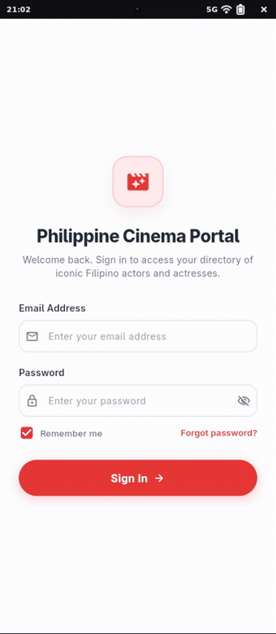

# Sean Cole P. Calixton

### Navigation

**Mobile Programming — Midterm Navigation & UI Showcase**

 

 

  <em>An elegant, responsive Flutter mobile app celebrating legends of Philippine Cinema with custom floating navigation, artist directory, and interactive profiles.</em>

 

<!-- App Preview Showcase -->
<table>
  <tr>
    <td align="center" style="background-color: #F8F9FA; padding: 24px; border-radius: 20px; border: 1px solid #E2E8F0;">
      
<b> Interactive Walkthrough</b>

      
        
      ✨ Smooth tab transitions • Floating bottom bar • Quick search & bio views
    </td>
  </tr>
</table>

